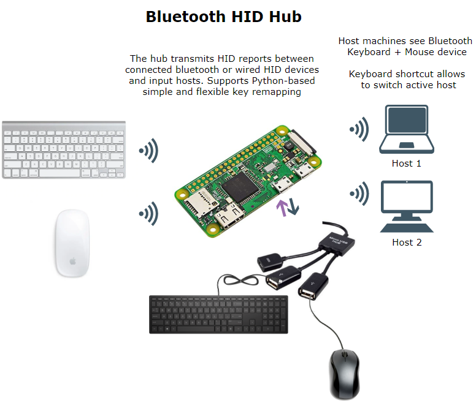
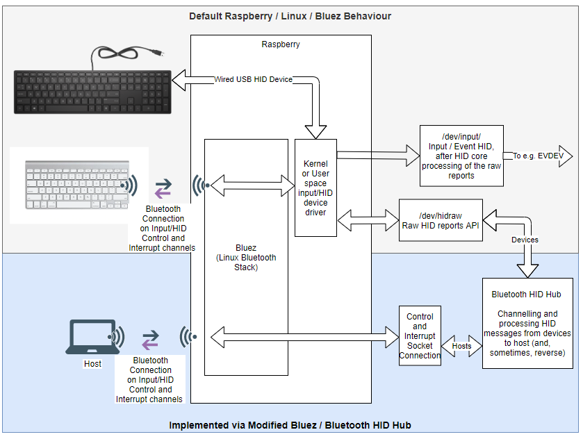

# Bluetooth HID hub

This hub uses a modified version of the Bluez linux bluetooth protocol stack (https://github.com/ruundii/bluez). The modified version extends bluetooth input profile to be able to **simultaniously** support host and device connections (vs default input device connections only).  With this you can e.g. retransmit Bluetooth input devices to other machines

The **Bluetooth HID hub** presents itself to a host computer as a Bluetooth kb+mouse device, and also connects to an Apple A1314 bluetooth keyboard and a wired mouse (my current set up). The hub remaps keys (essential for apple keyboards to be used on PC) and then transmits the host. I currently run it on my **Raspberry Pi Zero W**. Works like a charm, single digit millisecond delay is not noticable even with mouse, nevermind keyboard.

Now contains automated installation scripts for a newly flashed Raspbian OS (See install directory).

Has a interface to configure plugged and bluetooth input devices and connect to a bluetooth host machine.

Added an ability to switch hosts with a keyboard (Fn+Cmd+Tab on Apple A1314 keyboard). Now can use the hub as an input for several computers, easily switching which one is currently active.

Inspired by [RaspiKey](https://github.com/samartzidis/RaspiKey), but wanted the solution to stay wireless, as this is why I bought Apple wireless keyboard in the first place. By doing this it allowed to turn my wired mouse to wireless as well and have one keyboard+mouse for two machines. Also, Python implementation should allow people to easily customize their mappings. 
If you want to do this, check out [hid-tools](https://gitlab.freedesktop.org/libevdev/hid-tools) to monitor raw hid reports from your device.

I have configured pretty standard keyboard+mouse descriptor for this project (this defines how host machines see BT HID Hub and how they process its reports). Shall you want to support some fancy HID events, like unusual keyboard buttons, which are outside of the standard keyboard+mouse, you would need to edit HID descriptor in sdp_record.xml file. [This post](http://who-t.blogspot.com/2018/12/understanding-hid-report-descriptors.html) is super helpful in getting your head around HID descriptors.
