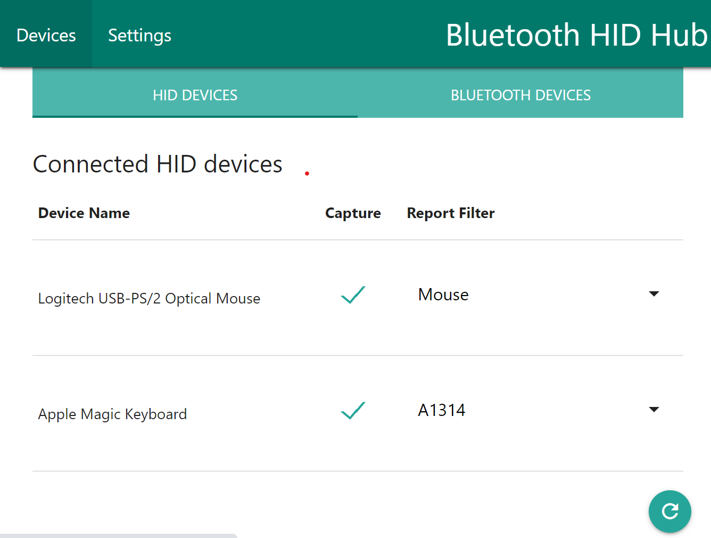
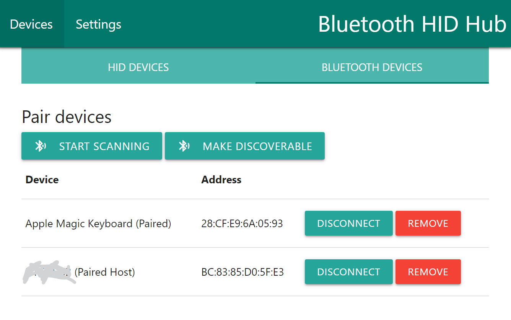

# bthidhub
# Bluetooth HID hub

This hub uses a modified version of the Bluez linux bluetooth protocol stack (https://github.com/ruundii/bluez). The modified version extends bluetooth input profile to be able to **simultaniously** support host and device connections (vs default input device connections only).  With this you can e.g. retransmit Bluetooth input devices to other machines

The **Bluetooth HID hub** presents itself to a host computer as a Bluetooth kb+mouse device, and also connects to an Apple A1314 bluetooth keyboard and a wired mouse (my current set up). The hub remaps keys (essential for apple keyboards to be used on PC) and then transmits the host. I currently run it on my Raspberry Pi Zero W.

Now contains automated installation scripts for a newly flashed Raspbian OS (See install directory).

Has a interface to configure plugged and bluetooth input devices and connect to a bluetooth host machine.

Soon will add an ability to switch hosts with a keyboard or mouse key combination (so you can use it as an input for several computers, easily switching which one is currently active).
